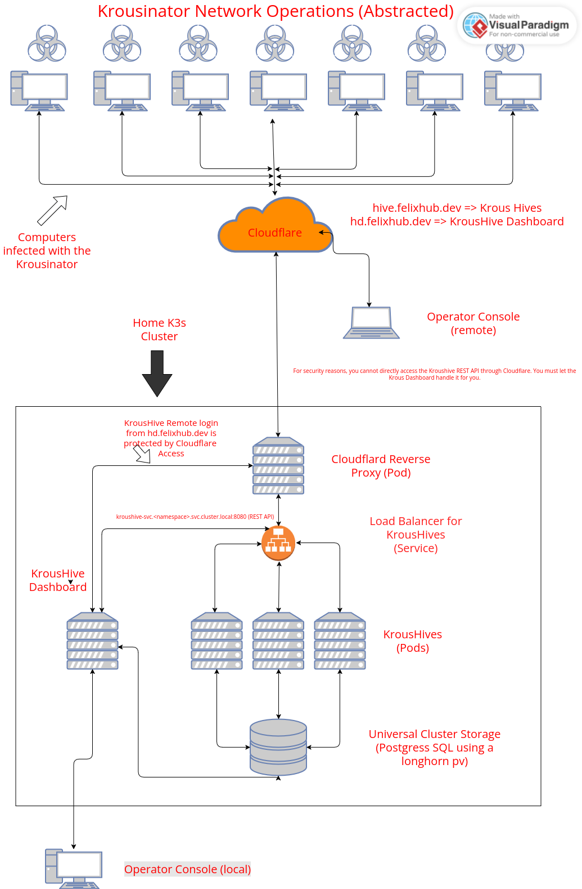

# Krousinator

Krousinator is a modular offensive security framework designed to orchestrate, deploy, and manage remote payloads across a distributed network of compromised clients. It combines stealthy communication, scalable design, and low-level injection to form a powerful botnet and remote command execution system.

> **Disclaimer:** This tool is for **educational and authorized testing** purposes only. Unauthorized access to systems is illegal.

---

---

## Key Components

### Kroushive (Command & Control Server)

The **Kroushive** is the central command and control (C2) server that runs within a **Kubernetes** cluster for high availability and scalability. 

**Responsibilities:**

- Managing client sessions
- Issuing commands to connected Krousinator clients
- Logging communications and events
- Managing a API server for operators to talk to
- Handling WebSocket reverse connections
- Writing back info to a central database

**Designed to scale:** The Kroushive supports horizontal scaling within Kubernetes, providing robust control over large botnets.

---

### Krousinator (Botnet Client)

The **Krousinator** is the payload dropped on target machines. Once executed, it connects back to the Kroushive and begins listening for commands.

**Responsibilities:**

- Establishing a persistent, stealthy connection to the C2 server
- Executing commands received from the Kroushive
- Supporting modular payloads and runtime extension
- Communicating system information back to the C2
- Acting as a programmable agent within the botnet

---

### Prerequisites

- Rust (for compiling core binaries)
- Kubernetes cluster (for running the Kroushive)
- Docker or Podman (for container builds)
- `kubectl` and optionally `k9s` for cluster management

---
